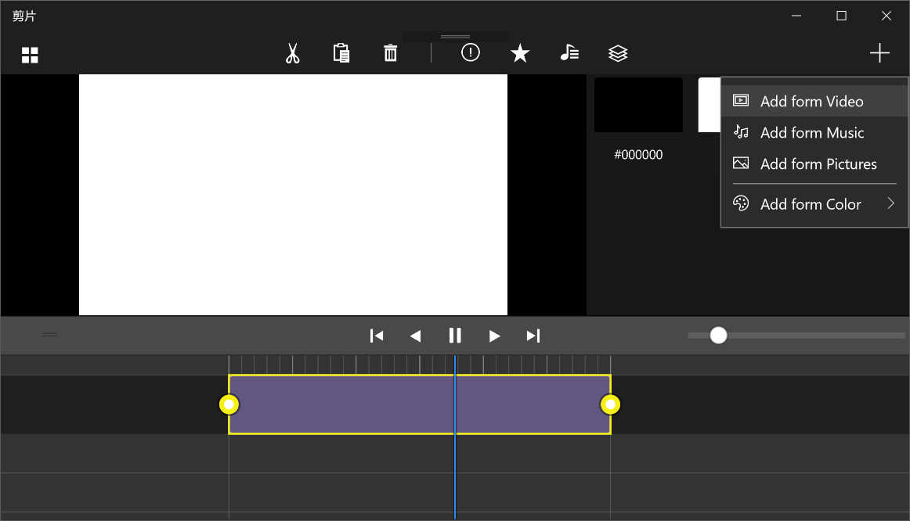
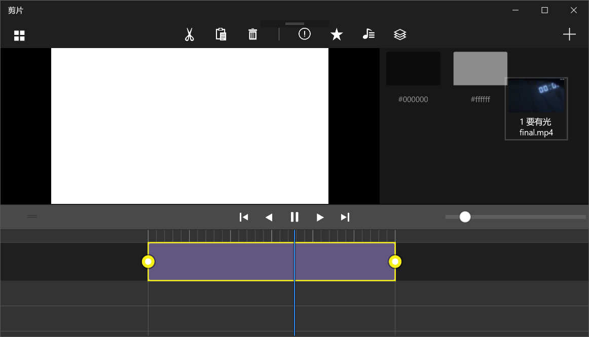
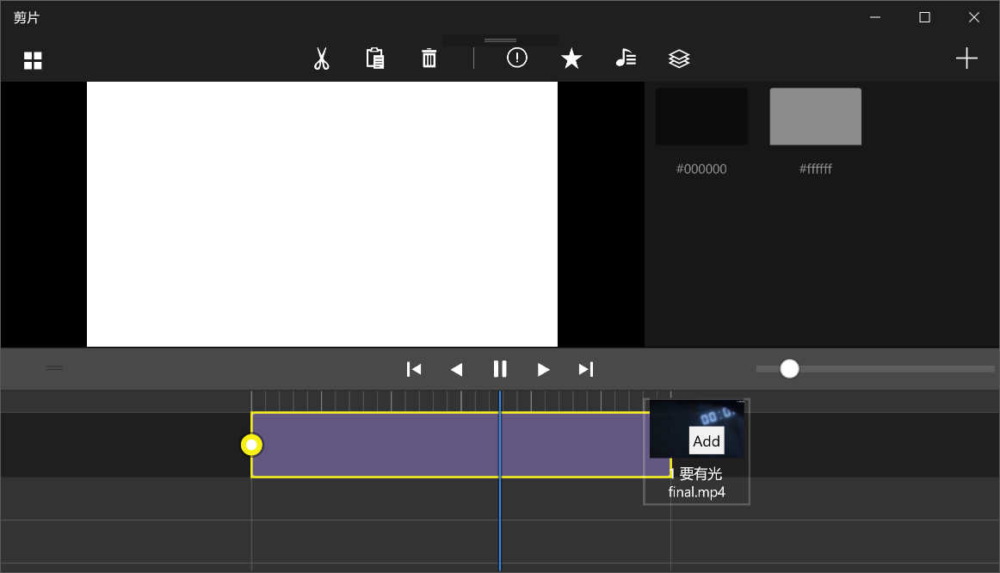
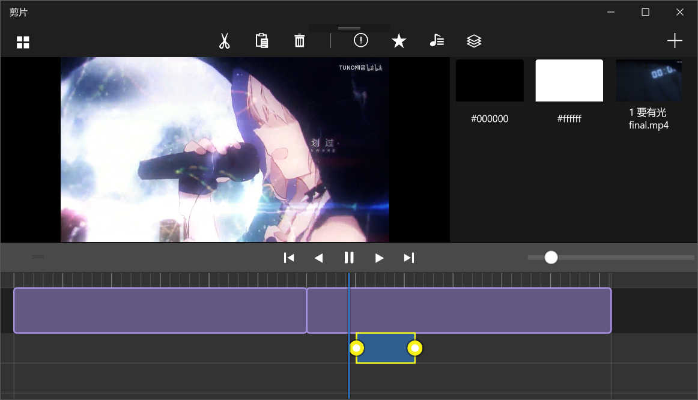
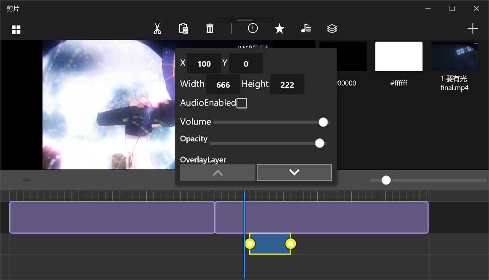
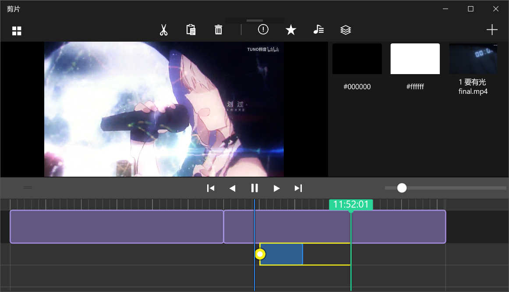

# Video-Clip-UWP
Clip and splicing MP4 video, from the material library to add video clips, coating, background music

## Get it
Download and run.  

## Development environment

|Key|Value|
|:-|:-|
|System requirements| Windows10 November Update or upper|
|Development tool|Visual Studio 2017|
|Programing language|C#|
|Display language|English|
|Comment language|English|

1.Add a video clips  

2.You will have more stock a media clip, drag it into the orbit  

3.You can drag the orbit, to view the Media Composition  

4.Select and modify the properties  

5.Trim  

